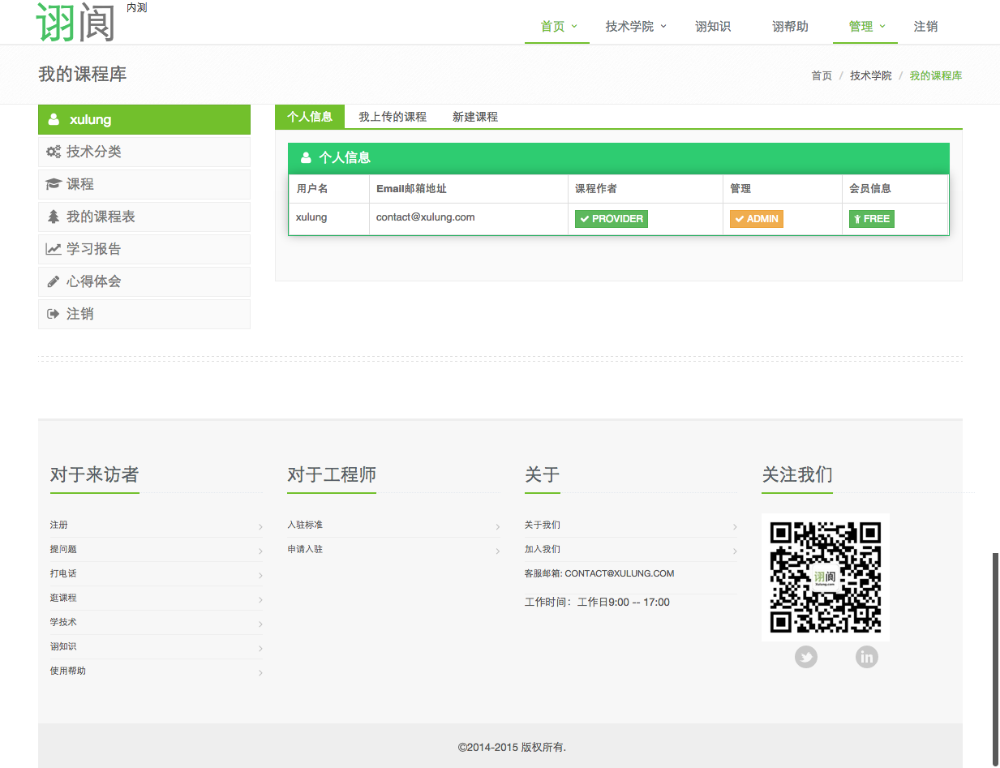
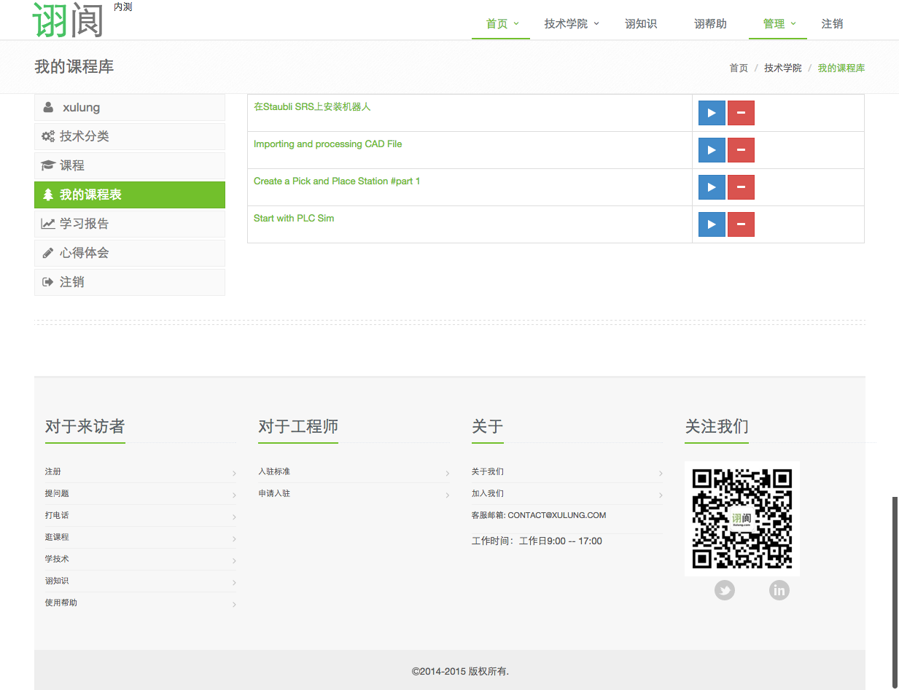
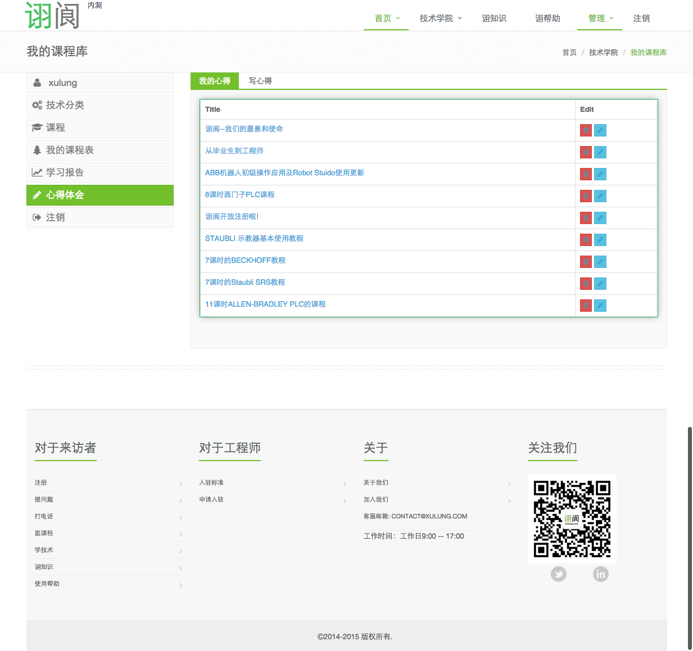
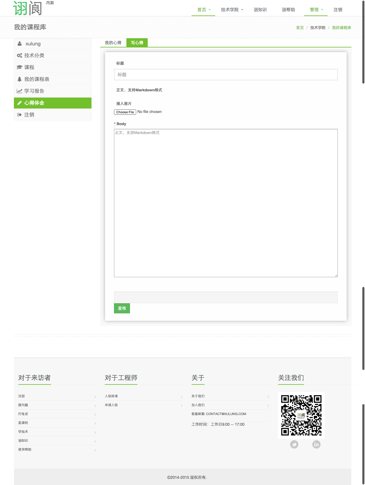
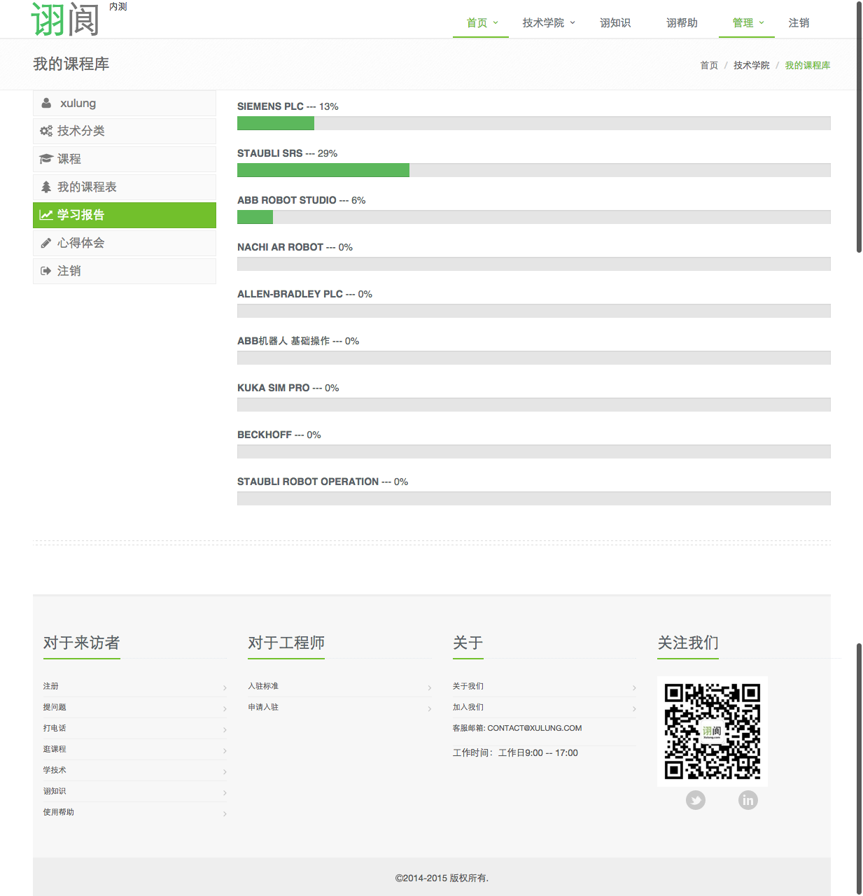

诩阆（来自于德语`schulung`)是一个工业自动化相关的公益项目，目的在于为有强烈自学能力的自动化工程师，提供一个免费学习的地方，于2018年关闭。

## 开发环境

```
ruby 2.1.5
rails 4.1.8
```

## 如何使用
1. 安装Docker
2. 运行以下命令
```bash
docker build -t xulung . 
docker run -itP xulung
```

##  界面照片/screenshot

- 主页/Home 


- 课程/Course


- 我的课程/Course


- 我的心得/Share


- 写心得/Editor


- 学习报告/Report 

